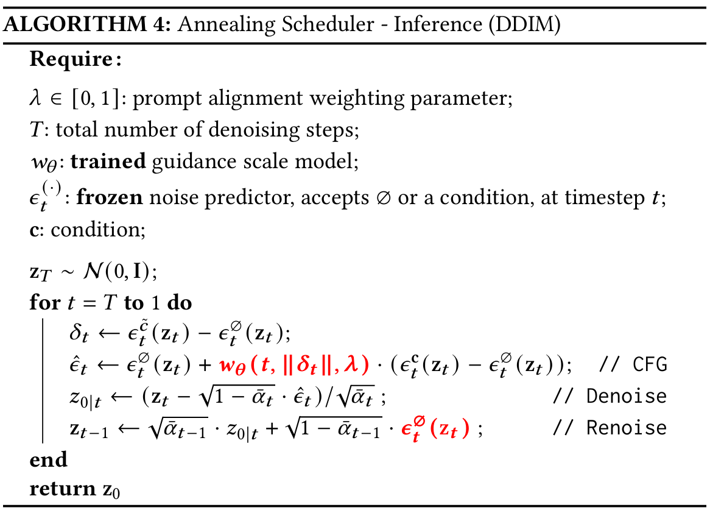

## Navigating with Annealing Guidance Scale in Diffusion Space

> **Shai Yehezkel\*, Omer Dahary\*, Andrey Voynov, Daniel Cohen-Or**
>
> Denoising diffusion models excel at generating high-quality images conditioned on text prompts, yet their effectiveness heavily relies on careful guidance during the sampling process. Classifier-Free Guidance (CFG) provides a widely used mechanism for steering generation by setting the guidance scale, which balances image quality and prompt alignment. However, the choice of the guidance scale has a critical impact on the convergence toward a visually appealing and prompt-adherent image. In this work, we propose an annealing guidance scheduler which dynamically adjusts the guidance scale over time based on the conditional noisy signal. By learning a scheduling policy, our method addresses the temperamental behavior of CFG. Empirical results demonstrate that our guidance scheduler significantly enhances image quality and alignment with the text prompt, advancing the performance of text-to-image generation. Notably, our novel scheduler requires no additional activations or memory consumption, and can seamlessly replace the common classifier-free guidance, offering an improved trade-off between prompt alignment and quality.

<a href="https://annealing-guidance.github.io/annealing-guidance/"></a> 
<a href="https://arxiv.org/abs/2506.24108"></a>

<p align="center">

</p>


We train a guidance scale model that predicts the optimal guidance scale at each denoising step. This model leverages the null prediction for renoising, as illustrated below:

<p align="center">

</p>


## Environment Setup

Create and activate the conda environment using the provided `environment.yml`:

```sh
conda env create -f environment.yml
conda activate annealing-guidance
```

---

## Running

To sample images with the trained annealing scheduler, edit and execute the script:

```sh
python scripts/sample.py
```

---

## Acknowledgements 
This code builds on the code from the [diffusers](https://github.com/huggingface/diffusers) library.

## Citation
If you use this code for your research, please cite the following work: 
```
@misc{yehezkel2025annealing,
      title={Navigating with Annealing Guidance Scale in Diffusion Space}, 
      author={Shai Yehezkel and Omer Dahary and Andrey Voynov and Daniel Cohen-Or},
      year={2025},
      eprint={2506.24108},
      archivePrefix={arXiv},
      primaryClass={cs.GR},
      url={https://arxiv.org/abs/2506.24108}, 
}
```